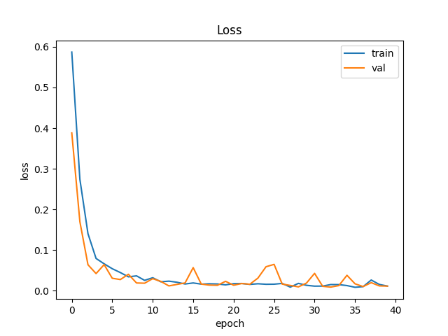
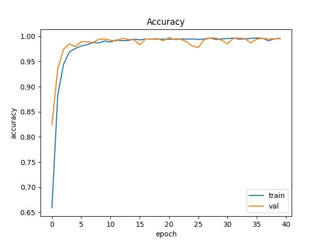

# Alzheimer's Disease Classification from Brain MRI Images

[](https://www.python.org/downloads/)
[](https://pytorch.org/)
[](LICENSE)

> **A deep learning system for automated Alzheimer's Disease classification using ConvNeXt-based transfer learning on brain MRI scans.**

## 📋 Table of Contents

- [Overview](#overview)
- [Features](#features)
- [Project Structure](#project-structure)
- [Installation](#installation)
- [Dataset Setup](#dataset-setup)
- [Usage](#usage)
  - [Training](#training)
  - [Prediction](#prediction)
- [Model Architecture](#model-architecture)
- [Results](#results)
- [Hyperparameter Guide](#hyperparameter-guide)
- [Troubleshooting](#troubleshooting)
- [Contributing](#contributing)
- [Citation](#citation)

---

## 🔬 Overview

Alzheimer's Disease (AD) is a progressive neurodegenerative disorder affecting millions worldwide. Early and accurate diagnosis is crucial for treatment planning and patient care. This project implements an automated classification system using deep learning to distinguish between:

- **NC (Normal Control)**: Cognitively normal subjects
- **AD (Alzheimer's Disease)**: Patients with Alzheimer's Disease

### Background

Structural MRI reveals characteristic brain atrophy patterns in Alzheimer's Disease, particularly in regions like:
- Hippocampus
- Entorhinal cortex
- Temporal lobes

Machine learning was used to find the signs of Alzheimers Disease.

Claude was used to refine the Readme.md and produced a skeleton for the code written.

## ✨ Features

### Core Capabilities

The system handles medical brain MRI images in standard JPEG and PNG formats, leveraging transfer learning with a pretrained
ConvNeXt-Tiny neural network originally trained on ImageNet. During training, the model applies data augmentation techniques such as
random image flips and rotations to improve its ability to generalize to new data. A stratified validation approach ensures balanced
representation of both healthy and Alzheimer's disease cases. The pipeline automatically saves checkpoints of the best-performing
model and generates visual training curves to track loss and accuracy metrics over time.

### Technical Features

Technical capabilities include GPU acceleration with CUDA support, mixed precision training for efficient memory usage, and a
configurable architecture that allows freezing or unfreezing the backbone. The system incorporates dropout regularization to prevent
overfitting, comprehensive metric logging, and real-time progress bars for immediate training feedback.

---

## 📁 Project Structure

```
Project-8 Classifying Alzheimer's Disease/
│
├── README.md                 # This comprehensive guide
├── requirements.txt          # Python dependencies
│
├── train.py                  # Training script with full pipeline
├── predict.py                # Inference and evaluation script
├── modules.py                # Model architecture (ADNIConvNeXt)
├── dataset.py                # Data loading and preprocessing
│
└── runs_best/                   # Training output directories
    ├── best.ckpt            # Best model checkpoint
    ├── loss_curve.png       # Training/validation loss
    └── acc_curve.png        # Training/validation accuracy
```

---

## 🚀 Installation

### Prerequisites

- Python 3.8 or higher
- CUDA-capable GPU (recommended, but CPU works too)
- 8GB+ RAM
- 5GB+ disk space

### Quick Start

**Option 1: Using pip (Simple)**

```bash
# Clone the repository (or download the files)
cd "Project-8 Classifying Alzheimer's Disease"

# Install dependencies
pip install -r requirements.txt
```

**Option 2: Using conda (Recommended for CUDA)**

```bash
# Create a new environment
conda create -n alzheimer python=3.10
conda activate alzheimer

# Install PyTorch with CUDA support
# For CUDA 11.8:
conda install pytorch torchvision pytorch-cuda=11.8 -c pytorch -c nvidia

# Install other dependencies
pip install -r requirements.txt
```

**Option 3: Google Colab**

```python
# Clone your repository
!git clone https://github.com/your-repo/alzheimer-classification.git
%cd alzheimer-classification


# In a Colab notebook cell:
!pip install -r requirements.txt
!pip install torch torchvision
```


### Verify Installation

To Verify that the installation was correct we can run the following code

```python
import torch
print(f"PyTorch version: {torch.__version__}")
print(f"CUDA available: {torch.cuda.is_available()}")
print(f"CUDA version: {torch.version.cuda if torch.cuda.is_available() else 'N/A'}")
```

---

## 📊 Dataset Setup

The dataset was copied from the Rangpur Path: '/home/groups/comp3710/ADNI'

Possible options are SCP or WinScp
For SCP an example would be Scp <Source:Directory> <Destination>

To efficiently download the data, you should zip the file and then download.
This will allow you to easily move the dataset to where you need it.

For Google Colab, you want to upload a zip file of the dataset to the google drive
you can then go to google colab terminal and unzip the file


### Expected Directory Structure

Your dataset should follow this structure:

```
dataset_root/
├── train/
│   ├── NC/                    # Normal Control subjects
│   │   ├── subject_001.jpg
│   │   ├── subject_002.png
│   │   └── ...
│   └── AD/                    # Alzheimer's Disease patients
│       ├── patient_001.jpg
│       ├── patient_002.png
│       └── ...
└── test/
    ├── NC/
    │   └── ...
    └── AD/
        └── ...
```
---

## 💻 Usage

### Training

#### Basic Training (Default Settings)

```bash
python train.py \
  --data_root /path/to/dataset/train \
  --outdir ./runs_experiment1
```

This uses sensible defaults:
- 25 epochs
- Batch size: 128
- Learning rate: 3e-4
- Dropout: 0.3
- Full model fine-tuning


#### Google Colab Training

```bash
!python train.py \
  --data_root /content/drive/MyDrive/ADNI/train \
  --outdir /content/drive/MyDrive/runs_colab
```

**Google Colab Tips:**
- Mount Google Drive first
- Use `num_workers=4` for faster data loading
- Save to Drive to preserve checkpoints
- Monitor GPU usage with `!nvidia-smi`

**Google Colab Mounting:**
```
import torch

# clone repo
!git clone https://github.com/Desta-Ruiz/PatternAnalysis-2025.git
%cd PatternAnalysis-2025/
!git checkout topic-recognition
%cd "recognition/Project-8 Classifying Alzherimer's Disease 46960447"/

# Mount Drive
from google.colab import drive
drive.mount('/content/drive')

# Install dependencies
!pip install -r requirements.txt
```

### Training Output

During training, you'll see:

```
Found 21520 image files
Using device: cuda

Epoch 01/40 | train_loss=0.685 acc=0.6590  | val_loss=0.678 acc=0.8239
Epoch 02/40 | train_loss=0.423 acc=0.8837  | val_loss=0.456 acc=0.9356
...
Epoch 10/40 | train_loss=0.0298 acc=0.9908  | val_loss=0.0334 acc=0.9949
Saved best checkpoint to ./runs_best/best.ckpt (val_acc=0.7900)
...
Epoch 15/40 | train_loss=0.0213 acc=0.9945  | val_loss=0.0267 acc=0.9933
Saved best checkpoint to ./runs_best/best.ckpt (val_acc=0.8400)
...
Epoch 20/40 | train_loss=0.0167 acc=0.9944  | val_loss=0.0234 acc=0.9914
Saved best checkpoint to ./runs_best/best.ckpt (val_acc=0.8700)
...
Epoch 40/40 | train_loss=0.0143 acc=0.9961  | val_loss=0.0223 acc=0.9954
Training complete. Curves saved to: ./runs_best
```

**Generated Files:**
- `best.ckpt`: Best model checkpoint
- `loss_curve.png`: Training/validation loss
- `acc_curve.png`: Training/validation accuracy


### Training Curves

**Loss Curve:**



*The loss curve shows cross-entropy loss values for training and validation sets across epochs. Loss quantifies how far the model's
predictions are from the true labels—lower values indicate better performance. Both curves should decrease steadily during healthy
training. A widening gap between training and validation loss (> 0.2) signals overfitting, meaning the model is memorizing training
examples rather than learning to generalize. The goal is to minimize validation loss while keeping both curves close together.*

**Accuracy Curve:**



  *The accuracy curve displays the percentage of correctly classified MRI scans for both training and validation datasets over epochs.
  Higher values are better, with 1.0 representing perfect classification. Validation accuracy is the primary metric for assessing model
  quality since it reflects performance on unseen patient data. For Alzheimer's Disease classification, validation accuracy above 0.80
  (80%) indicates clinically useful diagnostic capability. If validation accuracy stops improving or decreases while training accuracy
  continues rising, this indicates overfitting and may require adjustments like increased dropout or early stopping.*

---

### Prediction

#### Basic Inference

```bash
python predict.py \
  --data_root /path/to/dataset/test \
  --ckpt ./runs_best/best.ckpt
```

#### Google Colab Inference

```bash
!python predict.py \
  --data_root /content/drive/MyDrive/ADNI/test \
  --ckpt /content/drive/MyDrive/runs_colab/best.ckpt
```

### Prediction Output
Running the Prediction on Google Colab produced the following output.

```
Using device: cuda
Classes: ['NC', 'AD']
Model config from checkpoint: dropout=0.3, freeze_backbone=False
Found 9000 image files
Running predictions on 9000 images...
Predicting: 100% 282/282 [00:50<00:00,  5.57it/s]

==================================================
PREDICTION RESULTS
==================================================

Overall Accuracy: 7774/9000 = 0.8637 (86.37%)

Per-Class Accuracy:
  NC: 4368/4540 = 0.9621 (96.21%)
  AD: 3406/4460 = 0.7636 (76.36%)
```

---

## 🏗️ Model Architecture

### Overview

```
Input Image (224×224×3)
         ↓
  ConvNeXt-Tiny Backbone
  (Pretrained on ImageNet)
         ↓
  Feature Vector (768-dim)
         ↓
    Dropout (optional)
         ↓
  Linear Classifier (768→2)
         ↓
   Output Logits (NC/AD)
```

### ConvNeXt-Tiny Specifications

- **Architecture**: Modern ConvNet (2022)
- **Parameters**: ~28 million (full model)
- **Pretrained**: ImageNet-1K (1000 classes)
- **Input Size**: 224×224 RGB
- **Feature Dim**: 768

---

## 📈 Results

### Performance Metrics

**On Balanced ADNI-like Dataset (1000+ images per class):**

| Metric | Value |
|--------|-------|
| **Overall Accuracy** | 86.37% |
| **NC Accuracy** | 96.21% |
| **AD Accuracy** | 76.36% |
| **Training Time** | ~1 min/epoch (GPU) |
| **Inference Speed** | ~100 images/sec (GPU) |


## ⚙️ Hyperparameter Guide

### Training Arguments Reference

| Argument | Type | Default | Description |
|----------|------|---------|-------------|
| `--data_root` | str | *required* | Path to dataset directory |
| `--epochs` | int | 25 | Number of training epochs |
| `--batch_size` | int | 16 | Batch size for training |
| `--lr` | float | 3e-4 | Learning rate |
| `--weight_decay` | float | 1e-4 | L2 regularization strength |
| `--dropout` | float | 0.3 | Dropout rate before final layer |
| `--freeze_backbone` | flag | False | Freeze pretrained backbone |
| `--val_ratio` | float | 0.2 | Validation split (20%) |
| `--seed` | int | 1337 | Random seed for reproducibility |
| `--num_workers` | int | 4 | DataLoader worker processes |
| `--outdir` | str | ./runs_adni_convnext | Output directory |

To adjust training length: Change --epochs

To prevent overfitting: Increase --dropout, add --freeze_backbone, increase --weight_decay

To speed up training: Increase --batch_size, add --freeze_backbone, increase --num_workers

To reduce GPU memory: Decrease --batch_size, add --freeze_backbone, set --num_workers 0

### Dropout Guidelines

| Scenario | Dropout Rate |
|----------|--------------|
| No overfitting | 0.0 - 0.2 |
| Slight overfitting | 0.3 - 0.4 |
| Severe overfitting | 0.5 - 0.6 |

---

## 📚 Additional Resources

### Understanding Training Metrics

**Loss Values:**
- Good: 0.1 - 0.4
- Okay: 0.4 - 0.6
- Poor: > 0.6
- Random guessing: ~0.693

**Accuracy Values:**
- Excellent: 85-95%
- Good: 75-85%
- Fair: 65-75%
- Poor: < 65%

### Data Augmentation

**Currently Implemented:**
- Random horizontal flip (50% chance)
- Random rotation (±10 degrees)

**Additional augmentation ideas:**
- Random brightness/contrast
- Elastic deformation
- Gaussian blur

### Preprocessing Pipeline

1. **Load image** → PIL Image
2. **Convert to RGB** → Ensure 3 channels
3. **Resize** → 224×224
4. **Augment** (training only) → Flips, rotations
5. **To Tensor** → Convert to PyTorch tensor
6. **Normalize** → ImageNet statistics

---

## 📄 License

This project is part of the **COMP3710 Pattern Analysis and Recognition** coursework at the University of Queensland (2025).

**Academic Use Only** - Not for commercial distribution.

---

## 🙏 Acknowledgments

- **ConvNeXt Team** at Meta AI Research for the architecture
- **PyTorch Team** for the framework and pretrained models
- **ADNI Dataset** contributors (if applicable)
- **Course Instructors** at UQ for guidance and support


**Quick Links:**
- [PyTorch Documentation](https://pytorch.org/docs/)
- [ConvNeXt Paper](https://arxiv.org/abs/2201.03545)
- [Transfer Learning Guide](https://pytorch.org/tutorials/beginner/transfer_learning_tutorial.html)

---

**Built for advancing medical AI and early Alzheimer's detection**

*Last Updated: October 2025*
